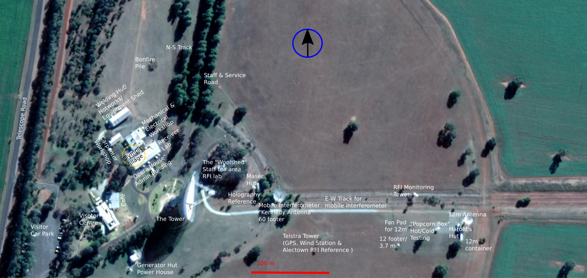

The CSIRO Parkes Radio Telescope
********************************

The Australia Telescope National Facility
=========================================

The `Australia Telescope National Facility (ATNF) <http://www.atnf.csiro.au/>`_ is managed as a National Facility by the `Commonwealth Scientific and Industrial Research Organisation (CSIRO) <http://www.csiro.au>`_. Formerly part of the CSIRO Division of Radiophysics, it became a separate division in January 1989. The ATNF became a National Facility in April 1990. In December 2009, ATNF became part of a new Division, CSIRO Astronomy and Space Science (CASS), together with NASA Operations (including the Canberra Deep Space Communication Complex), and CSIRO Space Sciences and Technology. The Australia Telescope continues as a National Facility, providing world-class observing facilities for astronomers at Australian and overseas institutions.

The majority of ATNF staff are located at the headquarters in Marsfield, a suburb of Sydney in New South Wales -- although Marsfield is sometimes referred to as 'Epping', a larger, neighbouring suburb. A growing number of ATNF staff are also located in the Perth suburb of Kensington, Western Australia at the Australian Resources Research Centre (ARRC).

Besides the Parkes telescope, the ATNF operates the Australia Telescope Compact Array (ATCA) which is comprised of an array of six, 22-m antennas and is located in Narrabri, NSW. ATNF also is currently commissioning the Australian Square Kilometre Array Pathfinder (ASKAP). The telescope has been constructed by ATNF in Murchison, Western Australia, and will be an array of thirty-six wide-field 12m antennas operating in the 0.7–1.8 GHz range. Commissioning of the first antennas is currently underway. More details are available on the `ASKAP project website <http://www.atnf.csiro.au/projects/askap/>`_. Additionally, the ATNF negotiates time with the CSIRO-administered 70-m and 34-m antennas at the Tidbinbilla Deep Space Tracking station outside Canberra. The ATNF telescopes are used together, in conjunction with the University of Tasmania telescopes at Hobart and Ceduna, as part of the Long Baseline Array for Very Long Baseline Interferometry (VLBI) observations. 

Overview of the Parkes Observatory
==================================

The Parkes Observatory is located 414.80m above sea level at Latitude -32d 59m 54.263s South, Longitude 148d 15m 48.636s East, 25 kilometres north of the town of Parkes which is approximately 365 kilometres west of Sydney.
It is 6 kilometres off the Newell Highway, the main road from Parkes to Dubbo. The Shire has a population of 15,000 and the town a population of 10,000 and is in the middle of a rich sheep, wheat producing and mining area. 

The Parkes site contains the 64-metre Radio Telescope, the 12-metre ASKAP prototype antenna, an administration building with offices, workshops and library, Visitors Discovery Centre and `The Dish Cafe <http://www.dishcafe.com.au/>`_. In addition, there are numerous testing and monitoring facilities on site. 

The observatory can be contacted at the following address:

| Australia Telescope National Facility
| Parkes Observatory
| 473 Telescope Road (or PO BOX 276)
| PARKES NSW 2870
| Australia
| Switch:(02) 6861 1700 [International +61 2 6861 1700]
| Fax: (02) 6861 1730 [International +61 2 6861 1730]

Visiting Parkes
-----------------
While the observatory supports fully-remote observing, there are many instances in which one might wish to visit the Parkes telescope and these visits are often allowed. All potential visits to the telescope should be discussed, and agreed upon, by an appropriate CSIRO staff member. Before any visit to site, it is essential to fill out a `visitation request form: <https://visit.atnf.csiro.au/>`_.

There are regular transport services to Parkes from Sydney by planes, trains and automobiles (bus). There are also buses from Canberra, Brisbane, Narrabri, Melbourne and Adelaide that stop at Parkes.

 Note that **there is no on-site accommodation offered at Parkes**, though there are numerous hotels in Parkes town that regularly support telescope visitors. 

Design and Operation of the CSIRO Parkes Radio Telescope
--------------------------------------------------------

The antenna has a paraboloid design with a 64-m diameter. The surface is high precision aluminium millimetre wavepanels to a diameter of 17-m (for operation to 43 GHz), then perforated aluminium plate out to 45-m, and rectangular galvanised steel 5/16-inch mesh for the remainder of the surface. The focal ratio is 0.41 for the full 64m surface, the focus being located 26-m above the centre. 

The aerial cabin, which houses feeds and receiver equipment, is supported by a tripod. Access to the aerial cabin is either by the lift on one of the tripod legs (the "lift leg") or by a ladder on one of the other legs. The feed platform translator, which can hold up to four receivers, at the base of the aerial cabin has up/down (focus), lateral and rotational movement. Further properties of the Radio Telescope are shown below.

- Weight of counterweights:         475 tonnes
- Total weight of the dish:         1,000 tonnes
- Surface area of reflecting mesh:  0.4 hectares (1 acre)
- Height of concrete tower:         10.7 metres (35 ft)
- Height to centre of dish:         27.4 metres (90 ft)
- Height to top of aerial cabin:    58.6 metres (192 ft)
- Power of Azimuth/Zenith drives:   11 kW (15 hp)
- Pointing accuracy:	            Generally less than 20 arcsec
- Coverage:                         Az 0-360 deg., El 30.5-88.5 deg.

The dish may be operated between the Zenith angle software limits of 1.2
and 59.5 degrees. There are three hardware limits at Zenith angles less
than 1.5 degrees, and also another three past 59.5 degrees. The dish can
be "stowed" at a physical limit 30 minutes of arc beyond the Zenith. It
is constrained in this position by a locking pin. Azimuth angle is
measured as 0 degrees due north, increasing to the east.