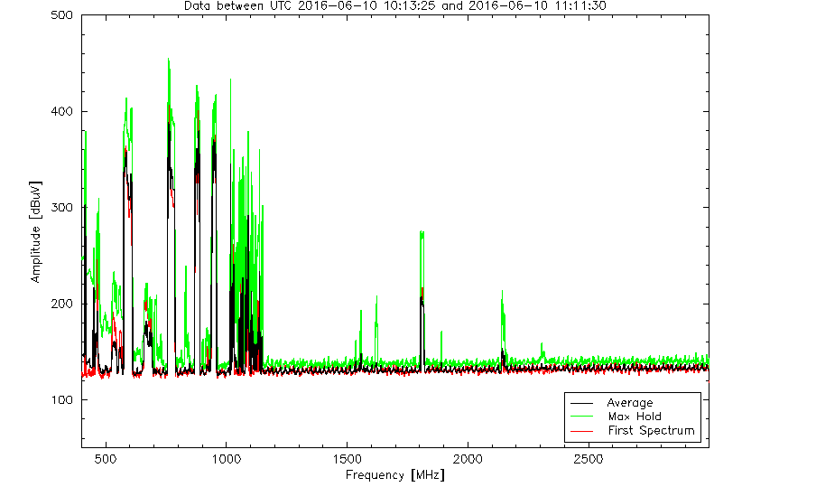
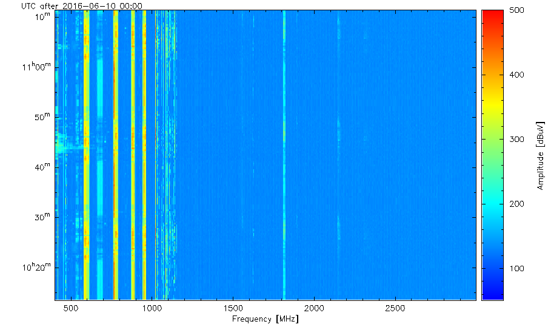
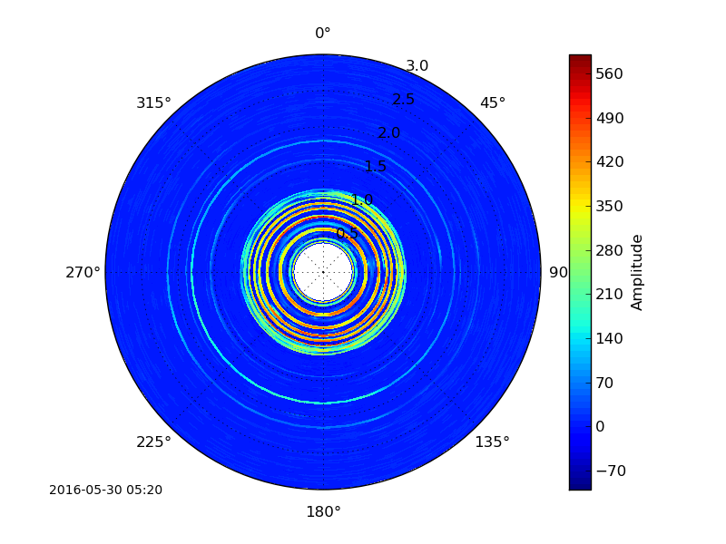
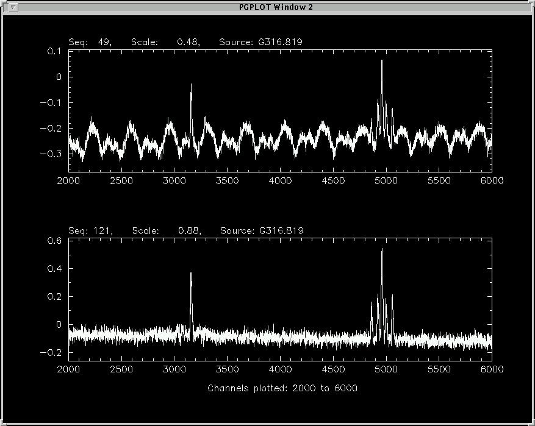

Planning Your Observations
**************************

Applying for Observing Time
===========================

To observe with the Parkes radio telescope you must apply for telescope time
through the time allocation committee process. This involves submitting a
proposal through `OPAL <https://opal.atnf.csiro.au/>`_, on a semester by
semester basis.

Parkes-specific information for upcoming semesters and submission deadlines
can be found `here <http://www.atnf.csiro.au/observers/>`_,
while current and archived observing schedules can be found
`here <http://www.parkes.atnf.csiro.au/observing/schedules/>`_.
Information regarding system capabilities not listed in the above can be
addressed to ATNF-Parkes-Remobs[at]csiro.au.

Once you have had a OPAL submission assessed by the Time Allocation Committee,
and it has achieved a ranking that enables it to be allocated time on the telescope,
you can create your observing schedule files.

Creating Schedule Files
=======================

For the majority of observations, you will be using the Telescope
Control Software *tcs*, through a graphical user interface (the *tcs* GUI), on
one of the remote VNC windows.

The **recommended** use of *tcs* is through schedule files (simple text-files appended with '.sch'),
which contain lists of keys and associated values which become the default
parameters on the *tcs* GUI. The exact format of these schedule files depends on the
nature of the observations being made. You can also manually select observing parameters
from the *tcs* GUI directly via widgets and entry boxes, however this is
recommended only for experienced observers who are conducting tests rather than
dedicated observing programmes.

TCS can control:

* Antenna Control (coord system, observation type)
* Tracking parameters (position, offset type, duration)
* Scanning parameters (scan center, scan range, duration/rate)
* Receiver control (receiver, focus, parallactic angle, feed angle)
* Correlator (mode, configuration)
* Local Oscillator (rest/sky frequency, bandwidth, channels, frequency switching/offset, frame)
* Cal Control Unit (enable/disable cal injection for receiver)
* Back End Controller Computer (enable :math:`T_{sys}` logging)

Archive information on keywords used in schedule files and
some examples can be found in the `2015 TCS  documentation <http://www.atnf.csiro.au/computing/software/tcs/tcs.html>`_
(noting this has not been recently updated).

There are a number of online utilities which
allow you to create a TCS schedule file for spectral-line, continuum and pulsar observations:

* `Position-switching <http://www.parkes.atnf.csiro.au/observing/utilities/pswitch.php>`_
* `Tracking <http://www.parkes.atnf.csiro.au/observing/utilities/track.php>`_ (with/without frequency-switching)
* `Beam-switching <http://www.parkes.atnf.csiro.au/observing/utilities/track.php>`_
* `On-The-Fly mapping <http://www.parkes.atnf.csiro.au/observing/utilities/otfscan.php>`_
* `Scanning <http://www.parkes.atnf.csiro.au/observing/utilities/otfscan.php>`_ (with/without frequency-switching)
* `Calibration <http://www.parkes.atnf.csiro.au/observing/utilities/spot.php>`_
* `Pulsar DFB4 fold and search observing <http://www.parkes.atnf.csiro.au/observing/utilities/pulsar_sched/>`_

When completed, save the schedule with the .sch appendage and
transfer it to a folder with your project code within /sched/tcs/ on joffrey.

Observing Modes
===============

Possible observing modes include:

* TRACK:  Simply track the position for the specified length of time.

* LINE-POINT: Execute a 5-point pattern about a target, along with one off-source position for bandpass reference (not currently implemented).

* MX: The position is tracked in turn by each beam (Multibeam receiver only.)

* MXCAL: Observe a calibrator with each beam in turn (Multibeam receiver only.)

* SCAN: The telescope scans from one end to the other at a requested rate.

* SPOT: Perform a four-point scan (forward/reverse in RA, forward/reverse in DEC), across a source for the purposes of defining pointing
  offsets and calibration purposes.

* EQUATORIAL/HORIZONTAL MIXED SCANS: Here the telescope can perform AZ-EL "spider" scans (..., -90, -45, 0, 45, 90, ...) referenced to an RA/DEC position. The scans are conducted along the Great Circle passing through the source. Mapping an area in AZ-EL centred on the RA/DEC position is also possible.

* RSCAN is where the telescope is continuously in scanning mode between two Azimuth limits (the TCS equivalent to the ATCA RSCAN). It has some precision synchronisation so that scans on subsequent days interleave correctly.

* PSCAN is a variant of RSCAN with calibration, i.e. an RSCAN is executed, in Azimuth, followed by a calibration observation. Note that strict LST synchronisation is required. A file defining the cal source and the  Azimuth scan details needs to be consulted before each set.

Position Switching
------------------

There are three methods of switching. Not all methods are available with all receivers/back-ends.

Using the TRACK mode, the telescope alternates between an on and off-source position where the latter is assumed to be free of line emission.
This mode is typically used for observing molecular lines such as Ammonia and Maser lines. Point-by-point mapping can be done with this mode.

Frequency Switching
-------------------

During an observation, the observing frequency alternates between a pair of frequencies. Both slow and fast modes are
available. This mode is often used for SCANNING on-the-fly observations which look at spatially-extended emission such as wide
(Galactic HI and narrow hydrogen recombination spectral lines. The second (switched) frequency is used as a reference spectrum which
aids in data reduction and can increase signal to noise by at least a factor of two over the position-switching mode.  The total frequency switch
can be either "in-band" or "out-of-band". The size of the throw depends on the nature of the emission you are seeking. The throw
should be at least 2-3 times the width of the widest profile you might expect in your data. You should also be aware if you are observing
multiple spectral lines within a bandpass, some of the data processing applications such as *Livedata* produce ghosts which may
overlap and be confused with real spectra. For estimating the size of the required throw,  for wide Galactic HI observations, a frequency throw of
about 3 MHz with an 8 MHz bandwidth is the norm. **This mode is not available for the Ultra-Wideband Low frequency receiver 'UWL'.**

Beam Switching
--------------

This is currently restricted to Multibeam receivers (MX mode). The position is tracked in turn by each required beam of the
Multibeam system. This mode is ideal for observing sources such as single galaxies (or multiple if all lie within the beam). When a beam is not
looking at the source we assume it's collecting a reference spectrum from blank sky.  The prior and following scans are used to form the bandpass
calibration.

Calibration Requirements
========================

Flux Calibration
----------------

Polarisation Calibration
------------------------

Pointing
--------
Pointing solutions are obtained by observatory staff for the receivers when they are installed. However, at high frequencies further pointing calibration is required.

Observing Considerations
========================

Radio Frequency Interference
----------------------------

An RFI monitoring antenna sits in the paddock near the 64-m dish. It monitors the frequency range 700 - 3000 MHz once every 20 seconds, with 2 MHz frequency resolution,
and presents its data in `near-real time <https://www.narrabri.atnf.csiro.au/observing/rfi/weathermap_parkes/>`_ with a clickable
version available `here <https://www.narrabri.atnf.csiro.au/observing/rfi/monitor/rfi_monitor.html#parkes>`_. Three
different plots are presented on the page: a “latest spectra” plot, a waterfall plot showing the last hour of data, and a polar skyplot
that may help in determining the direction in which RFI is being generated.  Examples are shown below. The latest spectra plot always shows
two of the most recent spectra obtained by the monitor, along with a “maximum hold” value for each channel over the last hour. The waterfall
plot is useful for seeing emission switch on or off over the last hour. All data from the RFI monitor is archived from approximately
November 2014. It is possible to `query the RFI database <https://www.narrabri.atnf.csiro.au/observing/rfi/monitor/rfi_monitor_archive_query.html>`_.

+--------+-----------+--------+
| Spectra| Waterfall | Skyplot|
| |rfi1| | |rfi2|    | |rfi3| |
+--------+-----------+--------+

An introduction to site RFI and past surveys at the site is available `here <http://www.parkes.atnf.csiro.au/observing/rfi/>`_.

Solar Interference
------------------

Ettore's report for MB20?

Standing Wave Reduction
-----------------------

For Parkes, characteristic small-scale ripple with periodicity 5.7 MHz arises from multiple reflections in the 26m space between
the vertex at one end, and the focus and/or underside of the focus cabin at the other. @ref{fig:standwave} shows 22 GHz
observations of a strong Ammonia source, G316.819, showing strong (1,1) and (2,2) transitions for 4 minutes (exact multiple of
60 seconds). The two observations were taken one after the other, the first (upper panel) with no special 'de-rippling'
measures, the lower taken in a mode where the receiver is moved cyclically up and down in the translator Y-axis to 'smear out'
the ripple with amplitude 6.3mm peak-to-peak (:math:`\lambda/2`) and period 60 seconds. This technique is available for use
with higher-frequency receivers only and proposers should contact Parkes Operations, ATNF-Parkes-Remobs[at]csiro.au before
submitting proposals.

Dish Surface Quality
--------------------

A 4 GHz holography survey of the dish surface was performed prior to the 1995 upgrade of the focus cabin. The report is available
`here <http://www.atnf.csiro.au/observers/memos/d96f83~1.pdf>`_.

Other surveys at 3.95 GHz (June 1996) and 12.75 GHz (July 1996) were performed after the installation of the new focus cabin. These reports and
details of the readjustment of the inner 44m of the Parkes reflector in December 1996 are  available
`here <http://www.atnf.csiro.au/people/Michael.Kesteven/PKS_HOLO/pks_holo.html>`_ and
`here <http://www.atnf.csiro.au/people/Michael.Kesteven/PKS_HOLO/surface_adjust.html>`_.

As part of the NASA Mars tracking contract in 2003/2004, the Parkes Telescope's surface was upgraded to make it more reflective and sensitive at
X-band :math:`\sim` 8.5 GHz. The surface upgrade improved the telescope's performance by about 1 dB (or 25%). A technical report is available
`here <http://www.parkes.atnf.csiro.au/news_events/surface_upgrade/panel_report.pdf>`_.
