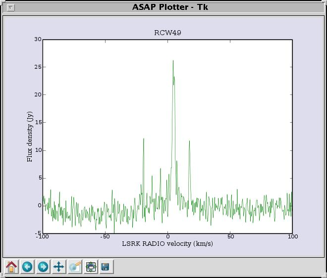
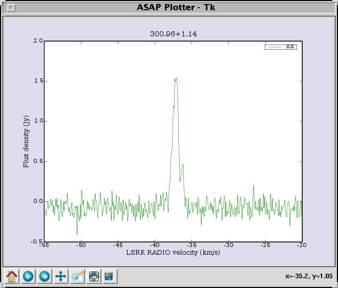
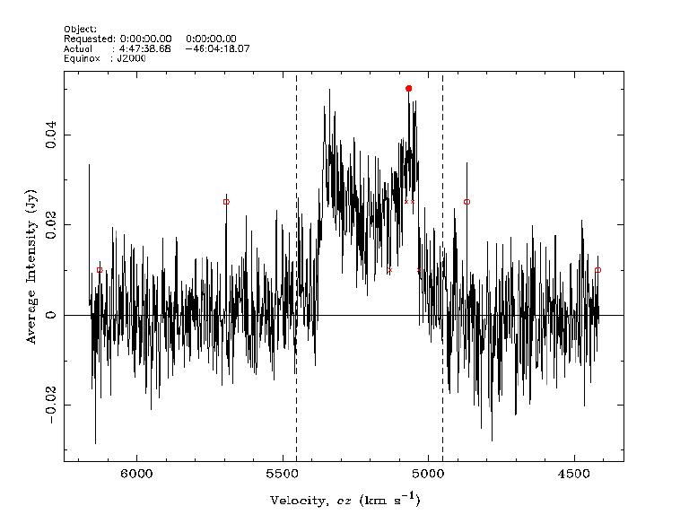

Data Reduction
**************

Data Access
===========

Spectral--line (non-pulsar) data is automatically uploaded into the `Australia Telescope Online Archive (ATOA) <http://atoa.atnf.csiro.au/>`_. 
Using your OPAL account, you can download data directly from ATOA. There is usally a gap of a few days between taking your data and seeing it in
ATOA. For Pulsar data, refer to the `CSIRO Data Access Portal (DAP) <https://data.csiro.au/dap/home?execution=e1s1>`_.

ATNF Data Format
================

Spectrometer data output from ATNF correlators is written in `RPFITS <http://www.atnf.csiro.au/computing/software/rpfits.html>`_
format. For Pulsar data, a modified version of the FITS standard, `PSRFITS <http://www.atnf.csiro.au/research/pulsar/index.html?n=Main.Psrfits>`_
is used.

Spectral line & continuum data
==============================

DFB spectral--line bandpass normalization
-----------------------------------------

As of June 2015, it has become known DFB3 and DFB4 spectral--line data lack the correct normalization and have not had the Tsys scaling applied.
To convert the individual raw spectrum R(p,t,c) for polarization p, time t and spectral channel c, it should be scaled as follows (courtesy
John Reynolds): ::

 S(p,t,c) = Tsys(p,t)/Av(p,t) * R(p,t,c) 

to obtain a calibrated spectrum S(p,t,c) where Tsys(p,t) is the Tsys scale-factor and Av(p,t) is the normalising term.
The values of Tsys(p,t) are stored in the RPFITS header and are available using the <scantable>.get_tsys() or <scantable>.get_tsysspectrum() 
commands within `ASAP <http://svn.atnf.csiro.au/trac/asap/wiki/AsapCommands`>_ (see below). A suggested method to correct the data within 
ASAP, is provided below. The script outputs corrected SDFITS files which can be reloaded into LIVEDATA or ASAP.

::

 import glob
 from asap import *
 import numpy as np

 files=[]
 types = ('*.rpf')
 for t in types:
 files.extend(glob.glob(t))

 for f in files:

  sc=scantable(f,average=False)

  sel=selector()

  scns = sc.getscannos()
 
  for scn in scns:

   sel.set_scans([scn])

   for nif in range(0,sc.nif()):
   
    sel.set_ifs([nif])
   
    for pol in range(0,sc.npol()):
    
     sel.set_pols([pol])
        
     sc.set_selection(sel)
    
     for cyc in range(0,sc.ncycle()):
 
      nspec = ( sc.get_tsysspectrum(cyc) / np.max( sc.get_spectrum(cyc) ) ) * sc.get_spectrum(cyc)
      sc.set_spectrum(nspec,cyc)
     
  sc.set_selection()
  sc.save('../renorm/'+f+'.sdfits','SDFITS',overwrite=False)

Applying the above scaling should render spectra calibrated in SEFD (system equivalent flux density, i.e. Janskys not Kelvins).

For polarization data, p=AA* or p=BB*, the normalising term Av(p,t) is simply the mean power of the (real) spectrum R(p,t,c), averaged over 
all spectral channels c. For the cross-polar terms p=AB* the correction is the geometric mean of the two parallel hands; 

::

 Av(AB*,t) = sqrt( Av(AA*,t) * Av(BB*,t) )

Opacity calculations
--------------------

FIXME: Show annual sky brightness, zenith attenuation and pwv plots at various frequencies.

In case the telescope is pointing to an astronomically empty part of the sky then the received signal will 
correspond to the system temperature, :math:`T_{sys}`. This can be resolved in its constituents (a) the emission
from the atmosphere that is a function of elevation and (b) every other contribution cumulatively described as 
T0 that is mostly elevation-independent:

.. math::`T_{sys} = T0 + T_{atm} * [1−exp(−\tau)] = T0 + T_{atm} * [1−exp(-\tau_{z}*AM)]`

T0 can be expanded into the following:

* :math:`T_{rec}`: receiver noise temperature
* :math:`T_{CMB}`: cosmic microwave background (~2.7K)
* :math:`T_{ground}`: radiation from the ground (spillover); elevation dependent.
* :math:`T_{ant}`: antenna temperature
* :math:`T_{RadBack}`: radio background from blends of weak sources (confusion), radio background etc.

For tau  1:

.. math::`T_{sys} ≃ T0 + T_{atm} * \tau_{z} * AM`

where :math:`\tau_{z}` = zenith opacity, AM = 1/sin(ELV), ELV = source elevation. Presuming that T0 and :math:`\tau_{z}` are 
constant, the system temperature is a function of the effective atmospheric temperature and the airmass (AM) which in turn is 
a function of elevation, in a linear fashion. Therefore, at any given :math:`T_{atm}` the 
:math:`T_{sys}` will increase linearly with increasing airmass (decreasing elevation). 

Opacity is not an issue for low-frequency (< 10 GHz) observations. However, for
observations of the 22.2GHz water line and Ammonia 23.6GHz (1,1), 23.7GHz (2,2) and 23.8GHz (3,3) lines, opacity
has to be taken into account. Normally, skydips are performed to determine the opacity
using the simple model above which assumes the system temperature will increase linearly with increasing
airmass (decreasing elevation). Within ASAP, the 'skydip' routine allows the user to input a
set of scans (assuming system temperature is being recorded). Skydips consist of scans fixed in Azimuth and the
telescope is moved up and down in Elevation. During this time, the system temperature is recorded
as a function of elevation.

While skydips are time consuming, Annex 2 of `ITU-R Recommendation <http://www.itu.int/rec/R-REC-P.676/en,ITU-R,P.676-8>`_ (10/2009) 
allows calculation of the Zenithal attenuation (opacity) due to atmospheric oxygen and water using ground weather-station data. 
A web form allowing calculation of Zenithal Opacites (and other meterological data) via the UTR is available
`here <http://www.parkes.atnf.csiro.au/cgi-bin/utilities/opacity.cgi>`_.

Spectral-line Calibration
-------------------------

Traditionally, spectral--line observing teams have devised their own means to calibrate data. A suggested
procedure using the SPOT mode of the Telescope Control Software (TCS), which is used to obtain
scaling factors using point sources can be found `here <http://www.parkes.atnf.csiro.au/cgi-bin/public_wiki/wiki.pl?PySPOT>`_.

In addition to calibration, the above utility can be used for high-frequency (13MM, 22-24GHz)
observations to determine pointing offsets using bright water maser and ammonia sources.

LIVEDATA & GRIDZILLA
--------------------

Detailed information on the specifics of LIVEDATA and GRIDZILLA
as related to the HIPASS and ZOA HI Surveys can be found in Barnes et al. (2001), MNRAS, 322 486.
The **GRIDZILLA** GUI contains a HELP menu item and the different sections of the
**LIVEDATA** GUI contains widgets, which when clicked on, present the user with a popup containing
information relevant to that section.

With **GRIDILLA** and **LIVEDATA**, it is possible to perform 
`batch processing via scripts <http://www.parkes.atnf.csiro.au/cgi-bin/public_wiki/wiki.pl?LIVEDATA/GRIDZILLA_Batch_Scripts>`_.

ASAP
----

The `ATNF Spectral Analysis Package (ASAP) <https://svn.atnf.csiro.au/trac/asap>`_ is a new software package to reduce single-dish, 
single-pointing spectral line observations. At this stage it is tuned towards data from ATNF instruments and reads RPFITS and is
able to output SDFITS, ASCII and CLASS format for processing within `GILDAS <http://www.iram.fr/IRAMFR/GILDAS>`_  and 
`SPECX <http://www.jach.hawaii.edu/JCMT/software/specx/>`_. Data reduction examples using ASAP can be found below.

Example **ASAP** batch script: POSITION SWITCHING 
^^^^^^^^^^^^^^^^^^^^^^^^^^^^^^^^^^^^^^^^^^^^^^^^^

In this example, observations at 22GHz are done in Position Switching Mode, where the source 
and a referenced position (free of line emission) are observed in sequence. The script below 
is saved into a file (called proc.py) and run from within ASAP by typing execfile('proc.py') or 
@code{python -i proc.py} from the command-line. It reads in and processes all RCW49 files in 
the current directory.

::

 import glob
 from asap import *

 fnames = glob.glob('*RCW49*.rpf')

 vec = []
 for f in fnames:
        vec.append(scantable(f,average=False))

 quotients = []
 for scan in vec:
        scan.set_unit('km/s')
        scan.set_freqframe('LSRK')
        scan.average_pol() #comment out this line to display both pols
	quotients.append(scan.auto_quotient())

 for q in quotients:
        msk = q.create_mask([-100,100])
        q.poly_baseline(msk,0)

 av = average_time(quotients)
 iav = av.average_pol()

 plotter.set_legend(mode=-1) # No legend
 plotter.set_range(-100,100,-5,30)
 plotter.plot(iav)

Example **ASAP** batch script: Beam Switching (MX Mode)
^^^^^^^^^^^^^^^^^^^^^^^^^^^^^^^^^^^^^^^^^^^^^^^^^^^^^^^

In Beam--Switching or MX mode, each beam of the 20CM or 6GHz Multibeam receivers is placed in 
turn on  the source of interest. When not on-source, the other beams are still aquiring data
and so are used as reference data. In this example (taken from the P502 Methanol Multibeam
Survey), the RPFITS file contains two IFS; the first (IF0) contains the Methanol maser line at 6668MHz 
and the second (IF1) contains Excited OH at 6035MHz. The IF selected depends on the index used 
in @code{selection.set_ifs()}. This example only shows data associated with IF0.
The script file is shown below.

::

 scans = scantable("2009-03-20_1025_MMB-MX-G300.96.rpf",average=False)
 scans.set_selection()
 selection = selector()
 selection.set_ifs(0)
 scans.set_selection(selection)
 scans.set_unit('km/s')
 scans.set_freqframe('LSRK')

 q = scans.mx_quotient()
 msk = q.create_mask([-55,-30])
 q.poly_baseline(msk,0)

 av = q.average_beam()
 iav = q.average_pol()

 plotter.set_range(-55,-20,-0.5,2)
 plotter.plot(iav)

MIRIAD
------

It is possible to process Parkes data using `MIRIAD <http://www.atnf.csiro.au/computing/software/miriad/>`_. Initially, data is 
processed using **LIVEDATA** and **GRIDZILLA**, where the latter produces a FITS file which can be loaded into MIRIAD using 
the FITS utility. As an example, here we load in a **GRIDZILLA**--created FITS file and use MIRIAD's MBSPECT  utility 
to display the profile of a galaxy, various parameters, plus create both an ASCII file of the spectra and a 
colour postscript file. The basic script below allows one to copy and past the code into a file (making it executable) for 
displaying a large number of sources quickly; it assumes the basename utility is available on your system.

::

 #!/bin/sh
 if [ $# -lt 1 ]; then
  echo "Please supply a FITS file"
  exit 0
 fi
 FILE=$1
 BASE=`basename ${FILE} .fits` #change suffix if different!
 OPT="options=measure"
 MSK="mask=4950,5450"

 if [ -d "${BASE}.mir" ]; then #remove existing image if present
  rm -rf ${BASE}.mir
 fi 

 fits in=${BASE}.fits op=xyin out=${BASE}.mir
 puthd in=${BASE}.mir/restfreq value=1.42040572 #insert rest freq of line
 mbspect in=${BASE}.mir xaxis=optical hann=2 order=-3 ${OPT} ${MSK} device=/xs log=${BASE}.spec
 mbspect in=${BASE}.mir xaxis=optical hann=2 order=-3 ${OPT} ${MSK} device=${BASE}.ps/cps

Running this script produces the following output and image.

::

 #FR   Clipped rms:    0.0066 Jy
 #FN   ( 654 out of 1024 channels)
 #     SPECTRAL FITTING
 #MC   xaxis: optical
 #MX   Maximum:      0.050 Jy   at   5065.440 km/s
 #MN   Minimum:     -0.028 Jy   at   6141.707 km/s
 #NP   Number of spectral points:  1024
 #SN1  Peak S/N ratio =       7.57
 #CL   Clipping inside range (    0.000,    0.000) Jy
       Moment:         0               1               2
 #MM                  9.660        5215.471         101.712
 #SN2  Mean S/N ratio =       0.83
       Robust moments: 0               1               2
 #MR                  9.744        5197.634         104.134
       units:        Jy km/s         km/s            km/s

For information on keywords used in the above script, please refer to the MIRIAD user guide. 

Gaussian fits within **ASAP**
^^^^^^^^^^^^^^^^^^^^^^^^^^^^^

Although MIRIAD has utilities to perform gaussian-fits to spectra, you can import the
ASCII file created from MBSPECT (using log=file) into ASAP. For example, place the following
code into the asapuserfuncs.py file (located in your $HOME/.asap directory).

::

 def readxy(filename=None):
     f = file(filename,'r')
     x = []
     y = []
     lines = f.readlines()
     f.close()
     for l in lines:
         vals = l.split()
         x.append(float(vals[0]))
         y.append(float(vals[1]))
     return x,y

Now when you run ASAP, you read in the ASCII file (with comments removed and only two columns)
and fit a two--component gaussian and output a Postscript file of the plot as follows.

::

 x,y = readxy('fred')
 f = fitter()
 f.set_data(x,y)
 f.set_function(gauss=2)
 f.fit()
 f.get_parameters()
 f.plot(components=[-1,0,1])
 f._p.set_axes('xlabel','velocity km/s (LSR-K)')
 f._p.set_axes('ylabel','Y-label')
 f._p.set_axes('title','Title')
 f._p.save('fred.eps')

Source finding programs
-----------------------

ASAP has the functionality to identify spectral lines within a data cube using 
`LINEFINDER <http://www.atnf.csiro.au/computing/software/asap/refman/public/asap.asaplinefind.linefinder-class.html>`_. 
Similarly, the `DUCHAMP <http://www.atnf.csiro.au/people/Matthew.Whiting/Duchamp/>`_ utility can search for spectral-line 
sources, produce source lists, spectra and moment maps. Users are encouraged to view the online documentation for these.

Pulsar data reduction
=====================
Overview of pulsar data products
--------------------------------
Pulsar data products come in three types:

1. **Fold-mode observations** in which the incoming data stream has been folded at the known pulsar period to form a pulse profile.  
2. **Search-mode observations** in which the incoming data stream is sampled at rates from around 64us to milliseconds, channelised and written to disk. These observations are used to search for currently unknown pulsars and also to study the single pulse emission from known pulsars.
3. **Baseband/voltage data streams** where the raw incoming data stream is recorded to disk.  This observing mode produces huge data volumes but provides maximum flexibility in how the data can be processed offline.

How to obtain your pulsar data
------------------------------
The majority of data sets obtained from the Parkes telescope are embargoed for a period of 18 months. During this time the data can only be accessed by the individuals on the original observing proposal relating to those observations.  In a few cases (such as PULSE@Parkes outreach observations with code P595, and P737 commissioning data from 2018OCTS onwards) have no embargo period.  A few other projects have had agreement from the director for an extended embargo period.  This includes the PX501 observations that have a 10 year embargo period.

The primary access point for pulsar data is through the Data Access Portal (known as the DAP - `<https://data.csiro.au/dap)>`_. The DAP is CSIRO’s long-term archive for Parkes pulsar data, which are available for download as individual files or in ‘collections’, bundled by project ID and observing semester. 

Data for search-, fold- and calibration-mode observations are available in PSRFITS format. Fold-mode observations are also available averaged in frequency and time, allowing a quick look at the data. 

Data files corresponding to observations with the PDFB4 and CASPSR backend instruments are usually available from the DAP within one week of the observation being completed. Specific observations taken with the BPSR backend are available from the DAP within 30 days of being completed, but also have an 18-month embargo applied.

Data for a few observation types and backend instruments are not available in the DAP:

1. Medusa observations with the ultra-wide-bandwidth receiver are currently not available through the DAP, but will be soon
2. Baseband data files are only available for specific observations, and currently only those containing FRB detections 

The DAP provides numerous access methods that are described in `Hobbs et al. (2011) <http://adsabs.harvard.edu/abs/2011PASA...28..202H>`_. We describe the two most common methods below.  

Accessing data from you observations
^^^^^^^^^^^^^^^^^^^^^^^^^^^^^^^^^^^^
If you are listed on a project proposal, you can access your own data during the embargo period by following the steps below:

* Navigate to data.csiro.au and log-in using your OPAL account
* In the search box type the project ID for your observations (e.g., P456) and select ‘search’
* Select your collection, click on the 'Files' tab, and select files for individual download (Max. 2GB), or scroll to the bottom of the page and select 'Download via WebDAV' for access to the whole collection
* Enter an email address and click 'request files' - you will receive a confirmation email once the collection is available

.. note::
If you are **not** logged in when you request data, you will receive a temporary password. If you are logged in when you request data, your credentials will be your OPAL account email (or NEXUS ident) and password.

For users with a CSIRO Unix account, a subset of the data files can be accessed on local machines in the archive directories,  prefixed with ‘$DFB_’ for PDFB fold-mode observations, ‘$DFBSRCH_’ for PDFB search-mode observations, ‘$UWL_’ for Medusa observations and ‘$CASPSR_’ for CASPSR observations.  It is likely that this access method will be deprecated in the near future, as we move towards using the DAP as the primary access point for pulsar data.

For users who are not CSIRO Unix account holders, your primary access point is the DAP.

Searching for observations that match a criteria
^^^^^^^^^^^^^^^^^^^^^^^^^^^^^^^^^^^^^^^^^^^^^^^^
If you wish to download all non-embargoed data files for a particular sky region or pulsar then use the cone-search interface available from `<http://data.csiro.au/psrsearch>`_.  This interface allows you to search on source name, project ID, sky position etc. and you can download one or more resulting data files.

For users with a CSIRO Unix account, a subset of the data files can be accessed on local machines in the archive directories,  prefixed with ‘$DFB_’ for PDFB fold-mode observations, ‘$DFBSRCH_’ for PDFB search-mode observations, ‘$UWL_’ for Medusa observations and ‘$CASPSR_’ for CASPSR observations.  It is likely that this access method will be deprecated in the near future, as we move towards using the DAP as the primary access point for pulsar data.

Need help?
^^^^^^^^^^
In some cases, you may experience delays when downloading large files or large collections. In such instances, please contact `<Lawrence.Toomey@csiro.au>`_ if you require assistance with these. 

Introduction to pulsar data reduction
-------------------------------------
Pulsar data analysis can be divided into (1) pulsar timing and forming pulse profiles, (2) searching for unknown pulsars and (3) studying individual pulses from known pulsars.  The standard software packages are freely-available.  Virtual machines and Docker images are also available in which the relevant packages are pre-installed.

Pulsar timing and forming pulse profiles
^^^^^^^^^^^^^^^^^^^^^^^^^^^^^^^^^^^^^^^^
The raw data files (as recorded and downloaded from the archive) require flux density and polarisation calibration procedures to be applied.  This is currently carried out using an observation of a switched calibration signal obtained just before or after the pulsar observation.  An initial polarisation calibration can be carried out using the PSRCHIVE software routine “pac”.  Flux calibration requires observations of a standard calibrator source.

The PSRCHIVE software package can be used to complete the processing of the data files. Tutorials on how to produce pulse profiles are summarised in van Straten, Demorest & Oslowski (2012) and are available from `<http://psrchive.sourceforge.net/tutorial/>`_. Pulsar timing relies on forming pulse arrival times (using the paas and pat software) and obtaining an initial timing model for the pulsar (from, e.g., `the pulsar catalogue, <http://www.atnf.csiro.au/research/pulsar>'_). The tempo2 software package is subsequently used for forming timing residuals and obtaining new timing model parameters.

Searching for unknown pulsars
^^^^^^^^^^^^^^^^^^^^^^^^^^^^^
The raw data files obtained from the DAP are in PSRFITS search mode format.  This works directly in packages such as dspsr and presto. However, the sigproc search software cannot read this format directly. A version, known as sixproc, does provide the ability to read this format and also provides a way to convert the format (using filterbank) to the sigproc filterbank format.

If a likely folding period is known then dspsr can be used to fold the data at the expected period and then pdmp used to carry out a small search in period and dispersion measure.  When searching for completely unknown pulsars the sigproc/sixproc or presto codes are used. These provide algorithms for carrying out periodicity and single pulse searches.  Search pipelines have been described at XX, YY, ZZ. In brief, a processing pipeline will carry out RFI mitigation, then de-disperse the data at a range of trial dispersion measures before carrying out the periodicity or single pulse search.  The pipelines produce a set of possible candidates that can be viewed by eye or ranked using machine learning algorithms. 

Studying individual pulses from known pulsars
^^^^^^^^^^^^^^^^^^^^^^^^^^^^^^^^^^^^^^^^^^^^^
There is a lack of software routines and tutorials on processing single pulses from known pulsars.  Tools such as dspsr can be used to extract individual pulses from a search mode data set. The resulting single pulses can then be processed using standard PSRCHIVE tools.  The pfits software package can be used to visualise the time series and `PSRSALSA <http://www.jb.man.ac.uk/~pulsar/Resources/psrsalsa.html>`_  can also be used to measure pulse energies, nulling fraction and drift rates.

Automatic searches for fast radio bursts
^^^^^^^^^^^^^^^^^^^^^^^^^^^^^^^^^^^^^^^^
Some project teams that use the BPSR backend and the multibeam receiver have requested that the data streams are automatically searched for the signatures of fast radio bursts (FRBs).  Such processing is carried out using Swinburne University computing facilities and emails are sent to the observing team with candidate fast radio bursts

Required Acknowledgements
-------------------------
Any publications resulting from Parkes pulsar data processing should acknowledge the Parkes telescope and, for data obtained from the data archive, the archive should also be acknowledged. The required statements are available from `<https://www.atnf.csiro.au/research/publications/Acknowledgements.html>`_.

Other Packages
==============

A list of `supported and non-supported data-reduction software <http://www.atnf.csiro.au/computing/software>`_
is availble via the link.

