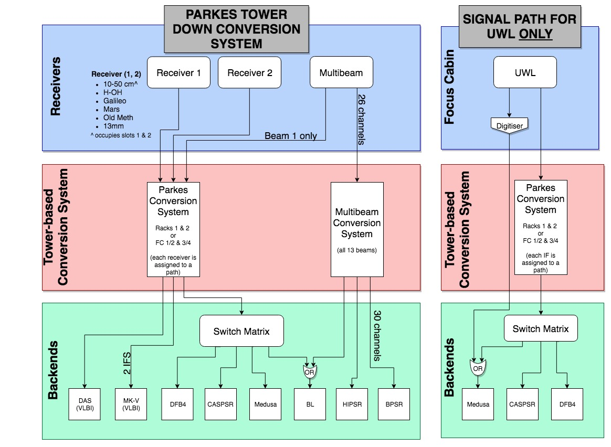

Receivers and Correlators
*************************

Sensitivity
===========

When preparing your observing proposal, you are required to estimate the expected brightness and sensitivity of 
your source for your particular Correlator/receiver combinations. For spectral-line observations, sensitivity 
per bandwidth channel can be estimated from the following equations of line brightness and line flux respectively:

.. math::  T_{rms} (mK) \sim \frac{ T_{sys} }{ \sqrt{npol \frac{BW}{chan} \delta T} }

.. math:: S_{rms} (\frac{mJy}{beam}) \sim T_{rms} G  \eta_b

In the above, G is the main-beam gain (Jy/K) for a receiver defined from FIXME, npol is the number of polarisations (an 
average of two independent polarisation channels), BW is the bandwidth [MHz], nchan is the number of channels and 
:math:`\delta T` is the on-source integration time in seconds. :math:`\eta_b` is the beam efficiency factor 
:math:`\frac{\Omega_{mb}}{\Omega_{tot}}` = 0.7. For continuum, we need to calculate the sensitivity over the 
whole bandwidth. The continuum line brightness and line flux respectively become:

.. math:: T_{rms} (mK) \sim \frac{ T_{sys} }{ \sqrt{npol BW \delta T} }

.. math:: S_{rms} (\frac{mJy}{beam}) \sim T_{rms} G \eta_b

For both the line and continuum flux, the source is assumed to fill the main beam which has efficiency 
:math:`\frac{\Omega_{mb}}{\Omega_{tot}}` = 0.7. The :math:`1\sigma` theoretical RMS noise estimates for 
line and continuum observations can be estimated by using the on-line 
`sensitivity calculator <http://www.parkes.atnf.csiro.au/cgi-bin/utilities/pks_sens.cgi>`_.

Parkes Receiver Fleet
=====================

The system temperature across the Parkes frequency range is shown below. For each receiver (identified by
a coloured bar), the variation of :math:`T_{sys}` is shown across the band. Additional information on 
available receivers is provided in the table below.

=============  ========= ============  ========  ========  =========  =============  =========  ===========
Receiver       Band [cm] Range [GHz]   Diam [m]  FWHP [']  Tsys[K,a]  Sens [Jy/K,b]  Pols[c]    BandW [MHz]
=============  ========= ============  ========  ========  =========  =============  =========  ===========
1050CM         50        0.70-0.764      64        30       40        1.1?           2xL        64
\              10        2.60-3.60       64        6.4      35        1.1            2xL        1000
MULTI          21        1.23-1.53       64        14.2     28        1.1            26xL       300
H-OH           21/18     1.20-1.80       64        14.8     25        1.2            2xL        500
GALILEO        13        2.20-2.50       64        9.2      20        1.3            2xC        300
\              \         2.15-2.27       64        9.2?     20?       2.1?           2xC        120
\              \         2.29-2.30       64        9.2?     19?       1.4?           2xC        10
AT S-BAND[d]   13        2.20-2.50       64        9.2?     79?       1.9?           2xL        300
AT C-BAND[d]   6         4.50-5.10       64        4.5      50        1.3            C          500
AT X-BAND[d]   3         8.10.8.70       64        2.4      140?      1.2            2xL/C      500
\              3         8.10-8.70       64        2.4      140?      1.2            2xL        500
\              13        2.20-2.50       64        9.2?     79?       1.9?           C          300
METHANOL       5         5.9-6.0         64        3.4      55        1.4            2xC        300
MARS[e]        3         8.0-8.9         55        2.45     30        1.7            2xC        500
KU-BAND        2.2       12.0-15.0       64        1.9      50?       1.6?           2xL        500
13MM           1.3       21.0-24.0       55        1.3      05?       2.0?           2xC        500
\              \         16.0-26.0       55        1.4      95        2.2            2xL        1000
\              \         21.0-22.3       55        \        \         \              2xC        1000
=============  ========= ============  ========  ========  =========  =============  =========  ===========

Notes:

* [a] Includes typical atmospheric, ground and galactic contribution at Zenith.
* [b] Calculated over main-beam and using :math:`\frac{\Omega_{mb}}{\Omega_A}` = 0.7.
* [c] L = linear, C = circular.
* [d] AT S, C, X-BANDS: Dual linear feeds, :math:`\lambda`/4 plates avaliable for band centers.
* [e] Full bandwidth by special arrangement.

Most of the Parkes receivers allow injection of a calibration noise signal into the receiver waveguide ahead of the ortho-mode transducer (OMT). 
This is generally a more satisfactory method than injecting after the OMT or after the LNAs as these elements can then be modelled using the 
calibration signal. The calibration signal is generally injected through a coupler in the circular waveguide oriented at 45 degrees to the 
linear probes of the OMT. Thus the cal can be closely represented by a 100% linearly-polarised signal with an accurately known feed angle. 
The amplitude of the cal signal is adjustable by inserting or removing fixed attenuators between the noise source and the coupler. Changing 
the level requires access to the receiver in the focus cabin and takes of order 30 minutes. The cal can be switched on or off remotely as 
required, using an observer-selectable waveform. Typically the cal is run as a continuous low-level NAR (Noise-Adding Radiometer) with the 
cal level approximately 10% of Tsys, for a time-averaged increase of 5%. The frequency of the switching signal is typically between a few Hz 
and 500Hz. For more information on particular receivers, please refer below.

1050CM
------

The 50cm receiver in the 1050CM package injects a cal signal using a directional coupler after each LNA (strictly, after the 4-port hybrid used 
to combine the signal from each pair of opposing probes and LNAs). A splitter is used to generate two identical cal signals from the same noise 
source. Further information on the receiver can be found in `Granet et al. (2005) <http://ieeexplore.ieee.org/stamp/stamp.jsp?tp=&arnumber=959722>`_ .

20CM Multibeam
--------------

The Parkes telescope is equipped with a sensitive 13 beam receiver operating at 20cm, and a 26 channel spectral line correlator (13 beams by 
2 polarisations). The Multibeam system comprises 13 identical dual-linear feeds, each with cryogenically-cooled HEMT LNAs, covering a frequency 
range of 1230-1530 MHz. The FWHM of the center beam is 14.0 arcmin, beams 2-6 14.1 arcmin and beams 7-13 14.5 arcmin. The thirteen horns are disposed 
in a hexagonal pattern, with the inner and outer rings of beams having a radii 29.1 arcmin and 50.8 arcmin respectively. The receiver package rotated 
at an angle of 15 degrees to the scan direction presents a nearly uniformly spaced "comb" of beams spanning approximately 96 arcmins. Adjacent scans 
of 35 arcmins (0.583 degrees) thus have an approximately two-thirds overlap. The package can be rotated in feed angle up to -70 degrees and +83.75 from 
its neutral position; rotation is in a positive direction corresponds to increasing position angle on the sky, or anti-clockwise as shown below:

Further characterisation of the reciever can be found in the following:

* http://adsabs.harvard.edu/abs/2014PASA...31....7C
* http://adsabs.harvard.edu/abs/2010A%26A...521A..17K

H-OH
----

The H-OH receiver has an optional quarter-wave plate which can be inserted in the circular waveguide between the feedhorn and the OMT to achieve 
circular polarisation on the sky. The quarter-wave plate is inserted before the cal injection so in this case the cal signal resembles a 100% 
circularly-polarised signal on the sky but the cal signal alone cannot be used to model the precise properties of the quarter-wave plate.

Galileo
-------

The GALILEO receiver has cal injection into circular waveguide but uses a circularly-polarised OMT (cal signal resembles 100% linear on sky).

C/X-BAND
--------

The C-band and X-band receivers in the AT Multi-band receivers also have quarter-wave plates ahead of the cal injection.

MARS
----

The MARS (8.4 GHz; X–band) receiver has a built-in (non-removable) waveguide circular polariser also with cal injection between the polariser 
and OMT.

KU-BAND
-------

The LNA response is impacted by poor return loss effects (from the OMT and possible feed combination) below 12.6 GHz. All 
the test data measured in the lab starts from 12.5GHz (and typically goes to between 15 and 18GHz).

13MM
----

A K-band receiver covering 16-26 GHz was delivered and commissioned in September 2008 and July 2009. The receiver has wider 
frequency coverage than the older K-band receiver and appears to have the anticipated ~threefold advantage in Tsys at 22 GHz over the older 
package. The receiver can be installed with either of two feeds: a narrow-band feed and quarter-wave plate providing dual orthogonal circular 
polarisation over the frequency range 21.0 to 22.3GHz, or the standard feed providing dual orthogonal linear polarization over the 16 to 26GHz 
range. The package has two independent conversion systems allowing simultaneous operation at any two arbitrarily-spaced frequencies within the 
band limits. The 13MM receiver also has an optional quarter-wave plate used with the narrow-band VLBI feed covering the 22 GHz water transition. 
As with the H-OH receiver, the cal injection occurs after the polariser (between the polariser and the OMT). More information is available 
`here <http://onlinelibrary.wiley.com/store/10.1002/mop.23747/asset/23747_ftp.pdf;jsessionid=974C0503FBDB34ECC84BBD7F09618E7D.f02t03?v=1&t=ip8dyt91&s=2e68f9e1190ffd14592b8d33ed4946231734243a>`_ .

Conversion System
=================

The Parkes Conversion System (PCS) is summarised as follows:

* It is possible to observe simultaneously two widely separated spectral line 
  features within a receiver passband. Alternatively, in the case of a dual band receiver (eg. 
  The S-X receiver covering 2.2-2.5 GHz and 8.1-8.7 GHz), spectral line or broadband noise 
  observations may be made simultaneously for each of the bands.

* Dual polarisation is available for each of the observing frequencies, necessitating a 
  total of four conversion channels. However, as the modules are paired, only two independent 
  Local Oscillator (LO) systems are needed.

* The input bands are 300-750 MHz (UHF-band), 1.2-1.8 GHz (L-band), 2.2-3.6 GHz (S-band), and
  4.5-6.1 GHz (C-band). Observations outside these bands, for example at K-band (22 GHz) are 
  accommodated using an extra conversion on the receiver package or using LOs in the focus cabin
  and/or upstairs control room.

* Wherever possible signals generated by the local oscillator system should not fall 
  within any signal or intermediate frequency (IF) bands to reduce the incidence of internally 
  generated interference. Unfortunately, due to the very wide S-band (2.2-3.6 GHz), one of
  the LO frequencies may fall inside the band for some observing frequencies.

* Frequency switching may be used for observations of a single spectral line. For C-band
  inputs, frequency switching is available for two spectral lines simultaneously.

* In order to ensure the conversion system is capable of supporting simultaneous use of
  DFB4, BPSR, APSR and HIPSR, a number of 
  buffered outputs for each output bandwidth have been provided. Each of the 4 channels has 4 
  of 64 MHz, 3 of 128 MHz, 3 of 256 MHz, and 2 of 900 MHz bandwidth (BW) outputs available. One 
  complete set of outputs for each channel (64, 128, 256, and 900 MHz BW) have been provided 
  at the front of the conversion rack. The remaining system outputs are cabled to bulkhead 
  connectors in the rear of the rack for permanent connection to the DAS and an RF Switch Matrix.
  The latter operates the standard connections from the conversion system to the several correlators/backend units.
  It is operated by software and in most cases the connection Conversion System output to backend
  is automatically instated by the observation control software (TCS: Telescope Control System). 

An in-depth discussion of the PCS (including block diagrams) is available `here <http://www.atnf.csiro.au/people/Suzy.Jackson/paper3.pdf>`_.

Signal Path
===========

An overall outline of the Parkes observing system is shown below.

FIXME: update

Single-beam spectral-line observations have back-end options using 4, 8 or 64 MHz bandpass capabilities 
of the 2-bit Multibeam correlator, or patching in an  ATCA-style bandpass filter to provide 16 or 32 MHz 
bandpass capability. Wider bandwidths (>64 MHz) are available using the 8-bit Digital Filterbank 
(DFB4), but it is also possible to achieve smaller bandpasses with DFB4 (ie., 8, 16, 32 MHz).
For Pulsar observations, it is possible to switch simultaneously record data on several back ends at once.

Backends
========

A number of backend units are available:

* DFB4: spectral line, pulsar, continuum and polarimetry, for one IF dual polarization observations
* BPSR: multi beam digital backend for pulsar observations (up to 13 IFs dual polarization). 
* APSR: coherent dedispersion recorder for pulsar observations (one IF dual polarization). 
* HIPSR: a reconfigurable digital backend for the Parkes Multibeam receiver.

Please check the `Parkes Correlator Guide <http://www.parkes.atnf.csiro.au/observing/documentation/software/CORREL/index.html>`_. 
for information on capabilities or email ATNF-Parkes-Remobs[at]csiro.au to ascertain requirements.
